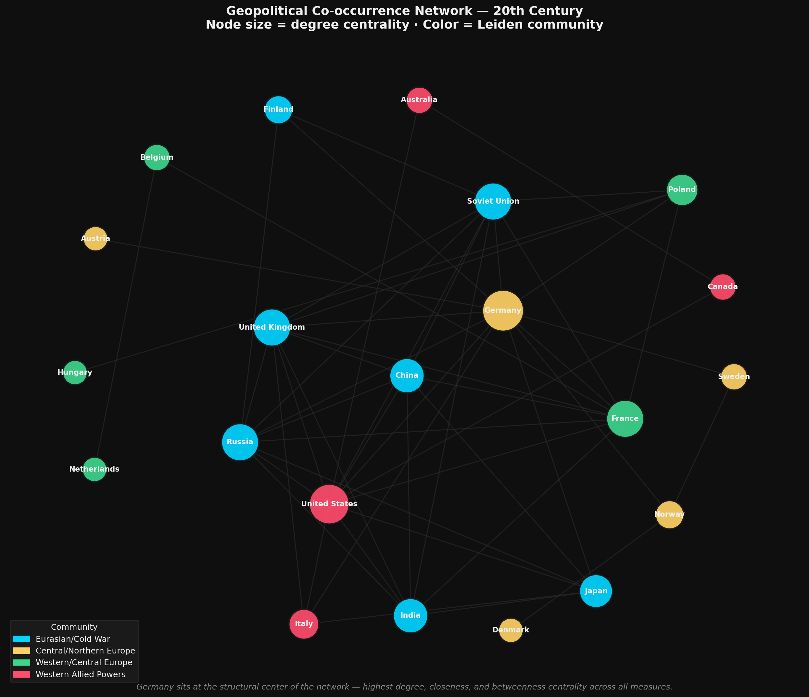
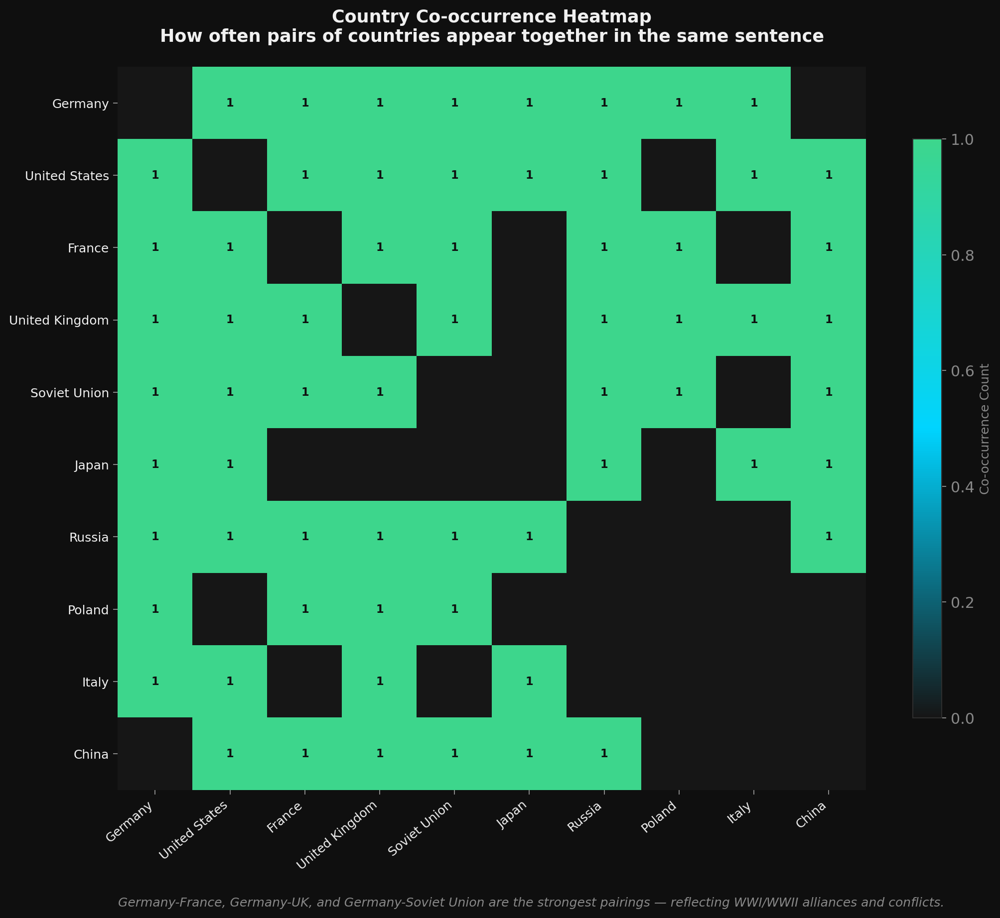
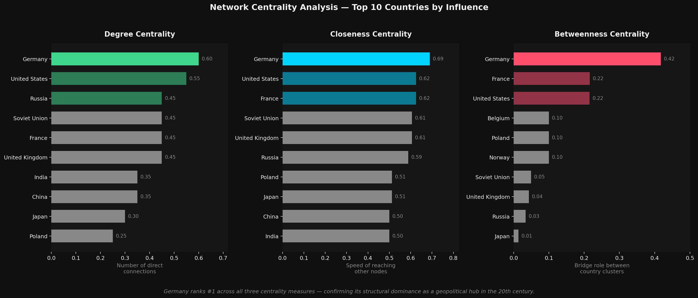

# 20th Century Text Mining & NLP

**End-to-end NLP pipeline** — web scraping, named entity recognition, and geopolitical network analysis of 20th century Wikipedia text.

[](https://python.org)
[](https://spacy.io)
[](https://networkx.org)
[](LICENSE)

---

## Overview

This project answers one question:

> **Which countries were most frequently co-mentioned in 20th century historical events — and do their co-occurrence patterns reflect real geopolitical alliances and conflicts?**

Starting from a raw Wikipedia article, the pipeline produces a structured network graph showing which nations were historically entangled, validated by community detection and centrality analysis.

**Result:** 21 countries, 53 unique geopolitical connections, 4 historically meaningful clusters — and Germany ranking #1 across all three centrality measures.

---

## Pipeline

```
Web Scraping (Selenium)
    → Text Cleaning (custom filter)
        → Text Mining (NLTK + TextBlob)
            → NER Extraction (spaCy GPE tags)
                → Alias Normalization (UK/Britain → United Kingdom)
                    → Network Construction (NetworkX)
                        → Community Detection (Leiden algorithm)
                            → Centrality Analysis (degree, closeness, betweenness)
                                → Visualization (Pyvis + Matplotlib)
```

---

## Notebooks

| Notebook | Description |
|---|---|
| [`20th_century_scrape.ipynb`](20th_century_scrape.ipynb) | Selenium scraping + text cleaning |
| [`20th_century_text_mining.ipynb`](20th_century_text_mining.ipynb) | Word frequency, POS tagging, country mentions |
| [`20th_century_ner_network.ipynb`](20th_century_ner_network.ipynb) | spaCy NER, alias normalization, co-occurrence extraction |
| [`20th_century_network_visualization.ipynb`](20th_century_network_visualization.ipynb) | NetworkX graph, Leiden community detection, centrality analysis |

---

## Key Findings

**1. Text cleaning determines analytical validity**
Navigation artifacts from the Wikipedia scrape (menus, edit links) would inflate country counts and create phantom network edges. The cleaning step is not preprocessing — it is a decision about what the analysis measures.

**2. Historical themes surface from word frequencies**
After stopword removal, `war` (151), `world` (98), `soviet` (87), and `nuclear` (58) dominate — confirming the article's geopolitical and conflict-driven focus.

**3. Alias normalization is essential**
Without mapping `UK`, `U.K.`, and `Britain` to a single node, the United Kingdom's network centrality is artificially fragmented across three separate nodes. Entity resolution determines structural graph validity.

**4. Germany is the structural center of 20th century geopolitics**
Ranks #1 across all three centrality measures:
- **Degree centrality:** 0.60 — most direct connections
- **Closeness centrality:** highest — reaches all countries through shortest paths
- **Betweenness centrality:** highest — acts as bridge between all cluster pairs

**5. Community detection recovers alliance structures from text alone**
The Leiden algorithm produced 4 clusters that closely mirror real 20th century alliance structures — demonstrating that co-occurrence patterns in historical text encode geopolitical reality.

---

## Network Visualizations

### Community Detection Network

*Node size = degree centrality · Color = Leiden community · Germany occupies the structural center*

### Co-occurrence Heatmap

*Germany–France, Germany–UK, and Germany–Soviet Union are the strongest pairings*

### Centrality Analysis

*Germany ranks #1 across degree, closeness, and betweenness centrality*

---

## Community Detection Results

| Community | Members | Historical Interpretation |
|---|---|---|
| Eurasian / Cold War | China, India, Japan, Russia, Soviet Union, UK, Finland | Cold War dynamics and Eurasian geopolitical interactions |
| Central / Northern Europe | Austria, Germany, Denmark, Norway, Sweden | Central/Northern European relationships — WWI and WWII era |
| Western / Central Europe | Belgium, France, Netherlands, Poland, Hungary | Western Allied powers and Central European connections |
| Western Allied Powers | Australia, Canada, United States, Italy | Anglo-American alliance structure in major 20th century conflicts |

---

## Network Statistics

| Metric | Value |
|---|---|
| Total nodes (countries) | 21 |
| Total edges (unique pairs) | 53 |
| Network density | 0.252 |
| Average clustering coefficient | 0.552 |
| Graph diameter | 5 |
| Communities detected (Leiden) | 4 |
| #1 Degree centrality | Germany (0.60) |
| #1 Betweenness centrality | Germany |
| #1 Closeness centrality | Germany |

---

## Installation

```bash
git clone https://github.com/ageelalramadhan/20th-century.git
cd 20th-century
pip install -r requirements.txt
python -m spacy download en_core_web_sm
```

> **Note:** ChromeDriver is required for the scraping notebook. A Mac ARM64 driver is included in `drivers/`. For other systems, download the matching ChromeDriver version from [chromedriver.chromium.org](https://chromedriver.chromium.org).

---

## Dependencies

```
selenium
beautifulsoup4
nltk
textblob
spacy
networkx
pyvis
cdlib
pandas
matplotlib
seaborn
```

Full pinned versions in [`requirements.txt`](requirements.txt).

---

## Data

| File | Description |
|---|---|
| [`20th_century_key_events.txt`](20th_century_key_events.txt) | Raw scraped Wikipedia text |
| [`20th_century_key_events_clean.txt`](20th_century_key_events_clean.txt) | Cleaned corpus (navigation artifacts removed) |
| [`country_relationships.csv`](country_relationships.csv) | Extracted co-occurrence pairs (Country1, Country2) |
| [`20th_century_interactive_network.html`](20th_century_interactive_network.html) | Interactive Pyvis network (open in browser) |
| [`20th_century_community_network.html`](20th_century_community_network.html) | Community-colored interactive network |

---

## Portfolio

Full case study with findings and visualizations:
**[ageelalramadhan.github.io/textmining-case-study.html](https://ageelalramadhan.github.io/textmining-case-study.html)**

---

## Author

**Ageel Alramadhan** — Data Analyst · Hamburg
[LinkedIn](https://www.linkedin.com/in/ageel-alramadhan/) · [Portfolio](https://ageelalramadhan.github.io)

*CareerFoundry Data Analytics Program · DEKRA-certified · AfA-approved · 1221 UE*
